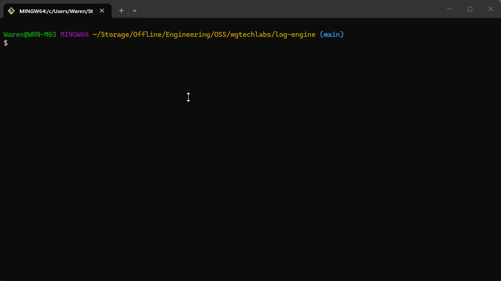

# contribute-now


<!-- Created with GitHub Repo Banner by Waren Gonzaga: https://ghrb.waren.build -->

**contribute-now** is a developer CLI that automates git workflows — branching, syncing, staging, committing, and opening PRs — so you can focus on shipping, not on memorizing git commands.

It natively supports multiple workflow models and commit conventions, with AI-powered assistance throughout.

[](https://www.gnu.org/licenses/gpl-3.0) [](https://www.npmjs.com/package/contribute-now)

## Demo



## Workflow Modes

Pick the model that matches your project during `cn setup`. contribute-now adapts its commands to your chosen workflow automatically — no manual branch names to remember.

| Mode | Branches | Strategy | Default |
|------|----------|----------|:-------:|
| 🌊 **Clean Flow** *(by WGTech Labs)* | `main` + `dev` + feature branches | Squash features → `dev`, merge `dev` → `main` | ✅ |
| 🐙 **GitHub Flow** | `main` + feature branches | Squash/merge features → `main` | |
| 🔀 **Git Flow** | `main` + `develop` + release/hotfix branches | Full ceremony branching | |

## Commit Conventions

contribute-now validates commit messages and guides your AI toward the right format — based on whichever convention you configure.

| Convention | Format | Default |
|------------|--------|:-------:|
| 🧹 **Clean Commit** *(by WGTech Labs)* | `<emoji> <type>[!][(<scope>)]: <description>` | ✅ |
| 📝 **Conventional Commits** | `<type>[!][(<scope>)]: <description>` | |
| 🚫 **None** | No enforcement | |

---

## Quick Start

```bash
npx contribute-now setup
# or
bunx contribute-now setup
```

Or install globally:

```bash
npm install -g contribute-now
contribute setup
```

`contribute-now` runs on Node.js at runtime. Node.js 26 is the default target, with Node.js 22 and 24 LTS also supported. Bun remains the toolchain for local development, builds, tests, and `bunx` workflows.

> `contribute` is the primary command; `cn` is the short alias for the same binary — use whichever you prefer.
>
> The older `contrib` alias is being phased out. Please switch to `contribute` or `cn`.
>
> **Fun fact:** `cn` is shorter than `git`. Yes, your workflow command is now faster to type than git itself. 🚀

---

## Installation

```bash
# one-off under Node.js
npx contribute-now setup

# one-off with Bun toolchain
bunx contribute-now setup

# global
npm install -g contribute-now
```

If you prefer Bun for installation, the packaged CLI still runs on Node.js after install:

```bash
bun install -g contribute-now
```

Once installed, you can use either alias:

```bash
contribute setup  # primary command — spelled out
cn setup          # short alias — even shorter than git!
```

> The legacy `contrib` alias still works but is being phased out. Prefer `contribute` or `cn`.

## Prerequisites

- **[Node.js](https://nodejs.org/)** — runtime target is Node.js 26 by default; Node.js 22 and 24 LTS are also supported
- **[Git](https://git-scm.com/)** — required
- **[GitHub CLI](https://cli.github.com)** (`gh`) — recommended; required for PR creation, role detection, and merge status checks
- **[GitHub Copilot](https://github.com/features/copilot)** — optional; one of the supported AI providers
- **[Ollama Cloud](https://ollama.com)** or **[OpenRouter](https://openrouter.ai)** API key — optional; alternative AI providers

---

## Commands

### `cn setup`

Interactive setup wizard. Configures your repo's workflow mode, commit convention, your role, branch/remote names, and AI provider settings. Writes local config to `.git/contribute-now/config.json` by default.

```bash
cn setup
```

Steps:
1. Choose **workflow mode** — Clean Flow, GitHub Flow, or Git Flow
2. Choose **commit convention** — Clean Commit, Conventional Commits, or None
3. Choose whether **AI features** should be enabled for this repo
4. If using **Ollama Cloud** or **OpenRouter**, enter your API key; pick from the available models returned by your key, or enter one manually
5. Detect remotes and auto-detect your **role** (maintainer or contributor)
6. Confirm branch and remote names
7. Write `.git/contribute-now/config.json` (or update `.contributerc.json` if that legacy file is still the active source)

If you want to disable AI completely for a repo, run `cn setup` and turn AI off, or set `"aiEnabled": false` in the active config file. Per-command `--no-ai` flags still work as one-off overrides when AI is enabled globally.

If you want a cleaner output once you're familiar with the CLI, set `"showTips": false` in the active config file to hide the beginner quick guides and loading tips.

---

### `cn config`

Inspect the active repo config or edit it without rerunning the full setup flow.

```bash
cn config
cn config --json
cn config --edit
```

Use `--edit` to update workflow settings, branch names, commit convention, AI provider details, stored API keys (Ollama Cloud or OpenRouter), and to choose from the currently available models for the selected provider.

---

### `cn sync`

Pull the latest changes from the correct remote branch based on your workflow and role.

```bash
cn sync         # with confirmation
cn sync --yes   # skip confirmation
```

| Role | Clean Flow / Git Flow | GitHub Flow |
|------|-----------------------|-------------|
| Maintainer | pulls `origin/dev` | pulls `origin/main` |
| Contributor | pulls `upstream/dev` | pulls `upstream/main` |

---

### `cn start`

Create a new feature branch from the correct base branch, with optional AI-powered branch naming.

```bash
# Direct branch name
cn start feature/user-auth

# Natural language — AI suggests the branch name
cn start "add user authentication"

# Skip AI
cn start "add user authentication" --no-ai
```

---

### `cn commit`

Stage your changes and create a validated, AI-generated commit message matching your configured convention.

```bash
cn commit                     # AI-generated message
cn commit --no-ai             # manual entry, still validated
cn commit --model gpt-4.1    # specific AI model
cn commit --group             # AI groups changes into atomic commits
```

After the AI generates a message, you can **accept**, **edit**, **regenerate**, or **write manually**. Messages are always validated against your convention — with a soft warning if they don't match (you can still commit).

**Group commit mode** (`--group`): AI analyzes all staged and unstaged changes, groups related files into logical atomic commits, and generates a commit message for each group. Great for splitting a large set of changes into clean, reviewable commits.

If `aiEnabled` is set to `false` in `.contributerc.json`, `cn commit` stays manual and `--group` is unavailable.

---

### `cn update`

Rebase your current branch onto the latest base branch, with AI guidance if conflicts occur.

```bash
cn update
cn update --no-ai   # skip AI conflict guidance
```

---

### `cn submit`

Push your branch and open a pull request with an AI-generated title and description.

```bash
cn submit
cn submit --draft
cn submit --no-ai
cn submit --model gpt-4.1
```

---

### `cn clean`

Delete merged branches and prune stale remote refs.

```bash
cn clean          # shows candidates, asks to confirm
cn clean --yes    # skip confirmation
```

---

### `cn status`

Show a sync status dashboard for your main, dev, and current branch.

```bash
cn status
```

---

### `cn doctor`

Diagnose the contribute-now CLI environment and configuration. Checks tools, dependencies, config, git state, fork setup, workflow, and environment.

```bash
cn doctor          # pretty-printed report
cn doctor --json   # machine-readable JSON output
```

Checks include:
- CLI version, active runtime, and Node.js runtime policy
- git and GitHub CLI availability and authentication
- active repo config validity and storage location
- Git repo state (uncommitted changes, lock files, shallow clone)
- Fork and remote configuration
- Workflow and branch setup

---

### `cn log`

Show a colorized, workflow-aware commit log. By default it shows only **local unpushed commits** — the changes you've made since the last push (or since branching off the base branch). Use flags to switch between different views.

```bash
cn log                # local unpushed commits (default)
cn log --remote       # commits on remote not yet pulled
cn log --full         # full history for the current branch
cn log --all          # commits across all branches
cn log -n 50          # change the commit limit (default: 20)
cn log -b feature/x   # log for a specific branch
cn log --no-graph     # flat view without graph lines
```

When no upstream tracking is set (branch hasn't been pushed yet), the command automatically compares against the base branch from your config (e.g., `origin/dev`). Protected branches are highlighted, and the current branch is color-coded for quick orientation.

---

### `cn branch`

List branches with workflow-aware labels and tracking status.

```bash
cn branch             # local branches
cn branch --all       # local + remote branches
cn branch --remote    # remote branches only
cn branch --sync      # sync refs (friendly alias of --prune)
cn branch --prune     # fetch remotes + prune deleted remote branches
```

Branches are annotated with workflow labels (e.g., base, dev, feature) and tracking info (upstream, gone, no remote).

---

### `cn hook`

Install or uninstall a `commit-msg` git hook that validates every commit against your configured convention — no Husky or lint-staged needed.

```bash
cn hook install     # writes .git/hooks/commit-msg
cn hook uninstall   # removes it
```

- Automatically skips merge commits, fixup, squash, and amend commits
- Won't overwrite hooks it didn't create

---

### `cn validate`

Validate a commit message against your configured convention. Exits `0` if valid, `1` if not — useful in CI pipelines or custom hooks.

```bash
cn validate "📦 new: user auth module"     # exit 0
cn validate "added stuff"                   # exit 1
```

---

### `cn label`

Apply existing labels to issues and pull requests, or get ranked label suggestions from content. All operations are non-interactive and automation-friendly.

```bash
# Apply one or more labels to an issue
cn label add --issue 42 bug,enhancement

# Apply labels with spaces in their names (no quotes needed in most shells)
cn label add --issue 42 bug,good first issue

# Apply labels to a PR
cn label add --pr 7 enhancement,needs triage

# Get ranked label suggestions for an issue
cn label suggest --issue 42

# Get ranked label suggestions for a PR
cn label suggest --pr 7

# Auto-apply top labels to a PR
cn label apply --pr 7

# Auto-apply top labels to an issue
cn label apply --issue 42

# Bulk preview (safe default): inspect open issues and PRs
cn label apply

# Bulk apply to open issues and PRs
cn label apply --yes

# Bulk apply to PRs only with custom limits
cn label apply --prs --yes --limit 30 --count 2 --min-score 5

# Force heuristic-only ranking (no AI)
cn label apply --pr 7 --no-ai

# Use a specific AI model for ranking
cn label apply --pr 7 --model gpt-4.1
```

**Label source strategy:**
1. Repository labels are fetched once and cached locally (`.git/contribute-now/labels.json`).
2. If the repository labels are a 100% name-match against the [Clean Labels](https://github.com/wgtechlabs/clean-labels) dataset, Clean Labels (with canonical descriptions) are used as the source.
3. Otherwise, repository-specific labels are used.
4. The local cache is used by default — no repeated `gh` API calls.
5. On label-not-found errors, the cache is automatically resynced and the operation is retried once.

**Auto-apply behavior (`cn label apply`):**
- Uses the same label scoring engine as `cn label suggest` (label names + descriptions vs issue/PR content).
- Applies only existing repository labels (never creates labels).
- Filters out labels that are already present on the target issue/PR.
- In bulk mode (no `--issue`/`--pr`), defaults to dry-run unless `--yes` is provided.
- Supports tunable controls: `--count`, `--min-score`, `--limit`, `--issues`, `--prs`, and `--dry-run`.
- Uses AI ranking by default when AI is enabled in your config, with automatic fallback to heuristic scoring.
- Pass `--no-ai` to force heuristic-only scoring or `--model <name>` to pick a specific AI model.

**Label input format:**
- Commas are the separator between labels.
- Spaces are part of a label name (`good first issue` is one label, not three words).
- Unknown labels are reported with close-match suggestions.

---

## AI Features

All AI features are **optional** — every command has a manual fallback. Three providers are supported: **GitHub Copilot**, **Ollama Cloud**, and **OpenRouter**.

| Command | AI Feature | Fallback |
|---------|------------|----------|
| `commit` | Generate commit message from staged diff | Type manually |
| `commit --group` | Group related changes into atomic commits | Manual staging + commit |
| `start` | Suggest branch name from natural language | Prefix picker + manual |
| `update` | Conflict resolution guidance | Standard git instructions |
| `submit` | Generate PR title and body | `gh pr create --fill` or manual |

Pass `--no-ai` to any command to skip AI entirely. Use `--model <name>` to select a specific model (e.g., `gpt-4.1`, `claude-sonnet-4`).

### AI Providers

| Provider | Auth | How it works |
|----------|------|--------------|
| **GitHub Copilot** *(default)* | `gh auth login` | Uses your existing GitHub/Copilot auth via the `@github/copilot-sdk` |
| **Ollama Cloud** | API key (stored in local secrets) | OpenAI-compatible API; model list fetched from your key on setup |
| **OpenRouter** | API key (stored in local secrets) | Unified API that routes to many model providers (OpenAI, Anthropic, Google, etc.) |

Select your provider during `cn setup` or change it later with `cn config --edit`. API keys for Ollama Cloud and OpenRouter are stored as plain JSON in `~/.contribute-now/secrets/store.json` with file permissions restricted to the current user (mode 0600) — never in the plain config file.

---

## Commit Convention Reference

### Clean Commit *(default)*

Format: `<emoji> <type>[!][(<scope>)]: <description>`

| Emoji | Type | When to use |
|:-----:|------|-------------|
| 📦 | `new` | New features, files, or capabilities |
| 🔧 | `update` | Changes, refactoring, improvements |
| 🗑️ | `remove` | Removing code, files, or dependencies |
| 🔒 | `security` | Security fixes or patches |
| ⚙️ | `setup` | Configs, CI/CD, tooling, build systems |
| ☕ | `chore` | Maintenance, dependency updates |
| 🧪 | `test` | Adding or updating tests |
| 📖 | `docs` | Documentation changes |
| 🚀 | `release` | Version releases |

Examples:
```
📦 new: user authentication system
🔧 update (api): improve error handling
⚙️ setup (ci): configure github actions
🔧 update!: breaking change to config format
```

→ [Clean Commit spec](https://github.com/wgtechlabs/clean-commit)

### Conventional Commits

Format: `<type>[!][(<scope>)]: <description>`

Types: `feat`, `fix`, `docs`, `style`, `refactor`, `perf`, `test`, `build`, `ci`, `chore`, `revert`

Examples:
```
feat: add user authentication
fix(auth): resolve token expiry issue
docs: update contributing guide
feat!: redesign authentication API
```

→ [conventionalcommits.org](https://www.conventionalcommits.org/)

---

## Config File

`cn setup` writes `.git/contribute-now/config.json` by default. If a legacy `.contributerc.json` already exists, it remains the active source until you migrate or remove it:

```json
{
  "workflow": "clean-flow",
  "commitConvention": "clean-commit",
  "role": "contributor",
  "mainBranch": "main",
  "devBranch": "dev",
  "upstream": "upstream",
  "origin": "origin",
  "branchPrefixes": ["feature", "fix", "docs", "chore", "test", "refactor"]
}
```

Use `cn config --edit` to change these values later without rerunning the full setup flow. If you are still on the legacy `.contributerc.json`, keep that file ignored until you migrate away from it.

---

## Development

```bash
git clone https://github.com/warengonzaga/contribute-now.git
cd contribute-now
bun install

bun run build   # compile to dist/cli.js
bun test        # run tests
bun run lint    # check code quality
```

If you use an SSH remote and your key has a passphrase, set up an SSH agent in WSL2 before running the CLI so Git can reuse the unlocked key instead of prompting on every new shell or command. A simple option is:

```bash
eval "$(ssh-agent -s)"
ssh-add ~/.ssh/id_ed25519
```

If you want the agent to come back automatically in new shells, use a helper like `keychain` and load it from `~/.bashrc`.

Bun powers local development, build, and test workflows. The packaged CLI runs on Node.js 22, 24, or 26, with Node.js 26 as the default runtime target.

## 🎯 Contributing

Contributions are welcome, create a pull request to this repo and I will review your code. Please consider to submit your pull request to the `dev` branch. Thank you!

Read the project's [contributing guide](./CONTRIBUTING.md) for more info.

## 🐛 Issues

Please report any issues and bugs by [creating a new issue here](https://github.com/warengonzaga/contribute-now/issues/new/choose), also make sure you're reporting an issue that doesn't exist. Any help to improve the project would be appreciated. Thanks! 🙏✨

## 🙏 Sponsor

Like this project? **Leave a star**! ⭐⭐⭐⭐⭐

Want to support my work and get some perks? [Become a sponsor](https://github.com/sponsors/warengonzaga)! 💖

Or, you just love what I do? [Buy me a coffee](https://buymeacoffee.com/warengonzaga)! ☕

Recognized my open-source contributions? [Nominate me](https://stars.github.com/nominate) as GitHub Star! 💫

## 📋 Code of Conduct

Read the project's [code of conduct](./CODE_OF_CONDUCT.md).

## 📃 License

This project is licensed under [GNU General Public License v3.0](https://opensource.org/licenses/GPL-3.0).

## 📝 Author

This project is created by **[Waren Gonzaga](https://github.com/warengonzaga)**, with the help of awesome [contributors](https://github.com/warengonzaga/contribute-now/graphs/contributors).

[](https://github.com/warengonzaga/contribute-now/graphs/contributors)
